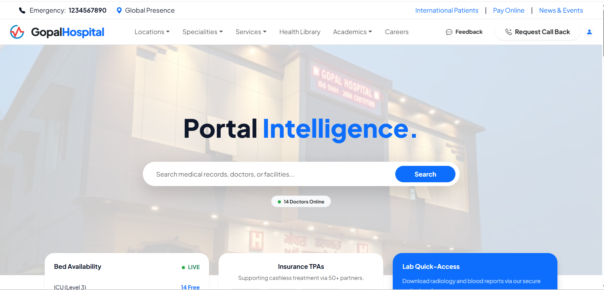
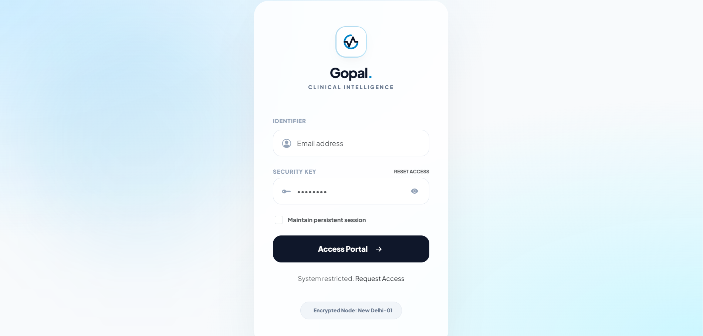
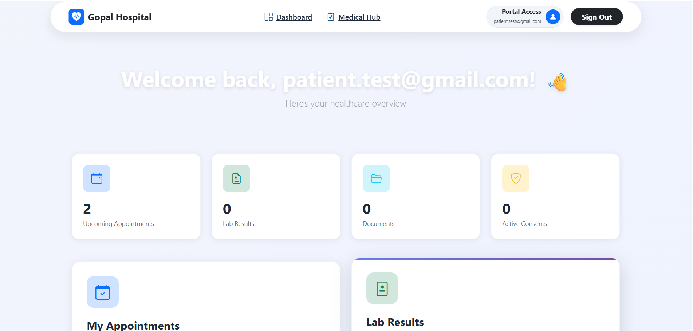

# 🏥 Gopal Hospital - MedicareX 
> A modern, web-based Medical Management System designed to bridge the gap between patients and healthcare providers.

[](https://github.com/shubham1440/Medical_Project)
[](https://github.com/shubham1440/Medical_Project)
[](https://opensource.org/licenses/MIT)

---

## 📌 Project Overview
**MedicareX** is a comprehensive digital solution developed for **Gopal Hospital**. It replaces traditional paper-based systems with a streamlined digital workflow for managing patient registrations, doctor consultations, and hospital administration.

### 🎯 Objective
* To provide 24/7 online appointment booking for patients.
* To organize medical records and patient history for doctors.
* To automate billing and staff management for hospital administrators.

---

## 📸 Visual Tour

### 🌐 Landing Page & Access
*The gateway for patients to explore hospital services and access their accounts.*

| Home Page | Login & Sign-up |
| :---: | :---: |
|  |  |

### 👤 Patient & Provider Panels
*Seamless coordination between the person seeking care and the medical professional.*

| Patient Appointment Dashboard | Doctor Confirmation & Management |
| :---: | :---: |
|  |  |
| *Patients can book and view history.* | *Doctors confirm appointments & issue prescriptions.* |

## ✨ Core Features

### 👤 Patient Portal
* **One-Click Appointment:** Book visits based on symptoms or specialty.
* **Medical Vault:** View past prescriptions and lab reports online.
* **Profile Management:** Update personal and emergency contact details.

### 👨‍⚕️ Doctor Portal
* **Live Queue:** See the list of scheduled patients for the day.
* **Patient History:** Access longitudinal health records during consultation.
* **Digital Prescription:** Generate and print prescriptions instantly.

### 🛡️ Admin Dashboard
* **Staff Management:** Manage doctor shifts and nursing staff.
* **Inventory Control:** Monitor medicine stocks and hospital supplies.
* **Financial Reports:** Track daily/monthly revenue and billing status.


🛡️ Security & API Gateway
Secure API Docs: Swagger UI is gated behind a modern login gate.

Dynamic Sessions: User-specific session timeouts managed via the database.

Real-time Protection: Custom filters check API key validity and lock status on every request.

---

🚀 API Documentation (Secure Access)
The system exposes a robust REST API for integration with lab systems and pharmacy modules.

URL: /swagger-ui/index.html

Security Layer: Gated by a custom ApiKeyAuthenticationFilter.

Access Control: Requires a valid Security Access Key stored in the database.

---

## 🛠️ Technical Stack

| Layer | Technology |
| :--- | :--- |
| **Frontend** | HTML5, CSS3, JavaScript, Bootstrap |
| **Backend** | PHP (Core) |
| **Database** | MySQL |
| **Server** | Apache (XAMPP / WAMP) |

---

## 📂 Project Structure

```text
medicarex/
├── src/main/java/com/gopal/
│   ├── controller/      # Route mapping (Home, Admin, Patient, Doctor)
│   ├── service/         # Appointment & Confirmation logic
│   ├── entity/          # User, Appointment, and Schedule models
│   └── repository/      # JPA Data Access
├── src/main/resources/
│   ├── templates/       # Thymeleaf HTML (admin/, patient/, doctor/ folders)
│   └── static/          # CSS, JS, and Images
└── screenshots/         # Project UI images
